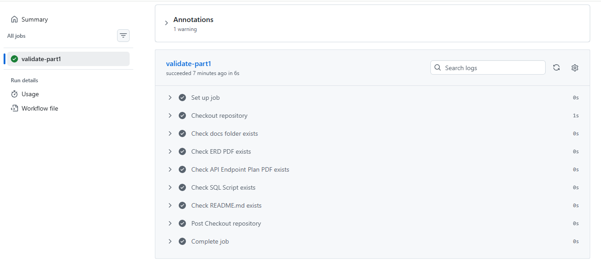

# RaceDay Event Management System


## System Description

RaceDay is a web-based event management system designed to support the planning and management of running, walking and cycling events. The system provides separate functionality for Organisers and Participants.

Organisers can create and manage events, define event categories, view participant enrolments and record race results. Participants can browse available events, view event details, enrol in events, manage their enrolments and view their results.

The system is planned around a relational database and a RESTful API. The database stores users, organisers, participants, events, categories, enrolments and results while maintaining relationships between these entities through primary and foreign keys. The API endpoint plan defines how users and the system will interact with these resources securely according to their assigned roles.


## User Roles

### Organiser

The Organiser is responsible for managing race events within the RaceDay system. An Organiser can create new events, update event information, delete events when necessary and create and manage event categories. Organisers can also view participant enrolments for their events and record or update race results.

### Participant

The Participant uses the system to discover and participate in race events. Participants can view available events and their details, enrol in an event under a selected category, manage their enrolments and view their results.

### Role-Based Access

The system uses role-based access control to ensure that users can only perform actions appropriate to their role. Organiser-specific operations, such as creating events and recording results, require an Organiser role. Participant-specific operations, such as enrolling in events, require a Participant role.


## Part 1 Deliverables

This repository contains the foundational planning and design work for the RaceDay system.

## Entity Relationship Diagram (ERD)

The RaceDay ERD defines the structure of the relational database and shows how the main entities are connected.

The `User` entity stores the common details of system users and identifies whether the user is an Organiser or Participant. Separate Organiser and Participant entities allow role-specific information to be stored while maintaining a relationship with the main User record.

An Organiser can manage multiple Events, while each Event belongs to one Organiser. An Event can contain multiple Categories, allowing participants to enter different categories within the same event.

The Enrolment entity connects Participants with Events and Categories. This represents a participant entering a specific category of an event and allows the system to keep track of enrolment status and date.

The Result entity is linked to an Enrolment. An enrolment can have zero or one result because a result may not exist until the participant completes the event or the organiser records the outcome.

Primary keys uniquely identify records, while foreign keys maintain referential integrity between related entities. This structure reduces unnecessary duplication and provides a clear foundation for implementing the RaceDay database.

### ERD Document

The complete ERD is available in the `docs` folder as `RaceDay_ERD.pdf`.


## API Endpoint Plan

The RaceDay API is planned using RESTful principles to provide clear and consistent communication between the client application and the database.

The endpoint plan uses HTTP methods according to the operation being performed:

* **POST** is used to create resources, such as registering users, creating events, creating categories, enrolling participants and recording results.
* **GET** is used to retrieve information, such as event details, categories, enrolments and results.
* **PUT** is used to update existing resources, such as user profiles, events, categories, enrolments and results.
* **DELETE** is used to remove resources such as events, categories and enrolments.

The endpoint plan also applies role-based access control. Public authentication endpoints do not require a role, while protected endpoints require an authenticated user and, where appropriate, a specific Organiser or Participant role.

The planned API also uses standard HTTP response codes. Successful requests can return `200 OK`, while newly created resources return `201 Created`. Invalid requests can return `400 Bad Request`, unauthorised requests can return `401 Unauthorized`, forbidden operations can return `403 Forbidden`, and requests for resources that do not exist can return `404 Not Found`.

### API Endpoint Document

The complete API endpoint plan is available in the `docs` folder as `RaceDay_API_EndPoint_Plan.pdf`.


### SQL Database Script

The SQL script, located at `docs/RaceDay_Database.sql`, is a working database implementation based on the ERD. It includes:

* CREATE TABLE statements for all 7 entities
* Primary key, foreign key, and other constraints
* NOT NULL, UNIQUE, CHECK, and DEFAULT constraints
* Realistic seed data, including 2 Organisers, 2 Participants, 3 Events, and sample Enrolments and Results

## Repository Structure

```text
RaceDay/
├── .github/
│   └── workflows/
│       └── part1-ci.yml
├── docs/
│   ├── RaceDay_ERD.pdf
│   ├── RaceDay_API_Endpoint_Plan.pdf
│   └── RaceDay_Database.sql
├── images/
│   └── ci-build-success.png
├── README.md
└── .gitignore
```

## Database Setup

To set up the RaceDay database on your local SQL Server instance:

1. Ensure you have SQL Server and SQL Server Management Studio (SSMS) installed.
2. Open SSMS and connect to your local SQL Server instance.
3. Open the `docs/RaceDay_Database.sql` script.
4. Execute the entire script by pressing F5.
5. This will create the `RaceDayDB` database, all tables, and populate them with sample data.
6. Verify the creation by running queries such as:

```sql
SELECT * FROM [User];
SELECT * FROM Organiser;
SELECT * FROM Participant;
SELECT * FROM Event;
SELECT * FROM Category;
SELECT * FROM Enrolment;
SELECT * FROM Result;
```

## CI/CD

This repository uses GitHub Actions for Continuous Integration (CI) to validate the Part 1 submission structure.

### Workflow

`.github/workflows/part1-ci.yml`

### What it checks

The workflow ensures that:

* The `docs` folder exists
* `RaceDay_ERD.pdf` exists
* `RaceDay_API_Endpoint_Plan.pdf` exists
* `RaceDay_Database.sql` exists
* `README.md` exists

### Successful CI Build

The CI workflow will display a successful green check once all required files are present.
### Successful CI Build




## Video Demonstration

An unlisted YouTube video explaining the planning decisions and demonstrating the SQL script running live will be added here:

**Video link:** To be added
